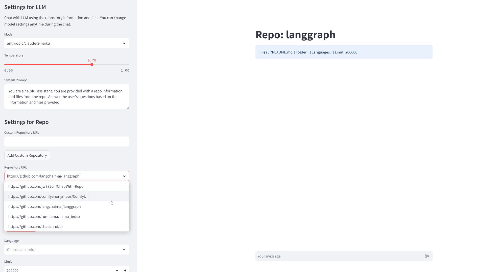
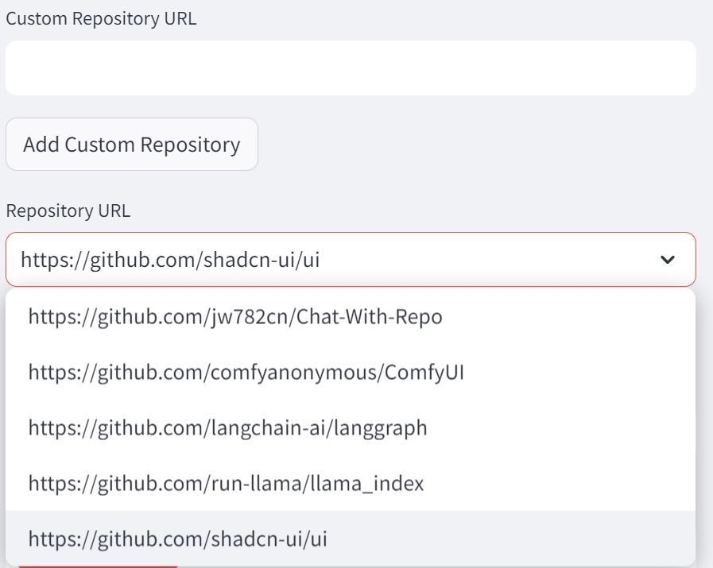
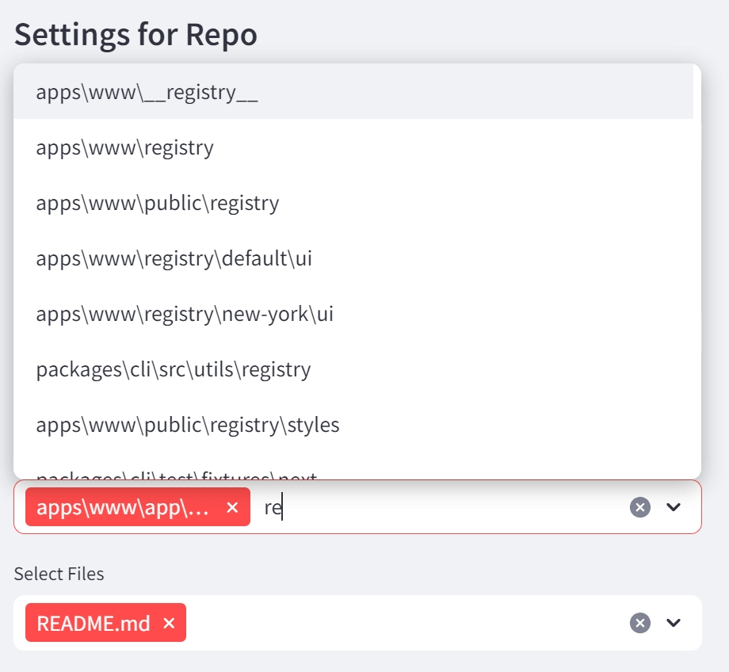
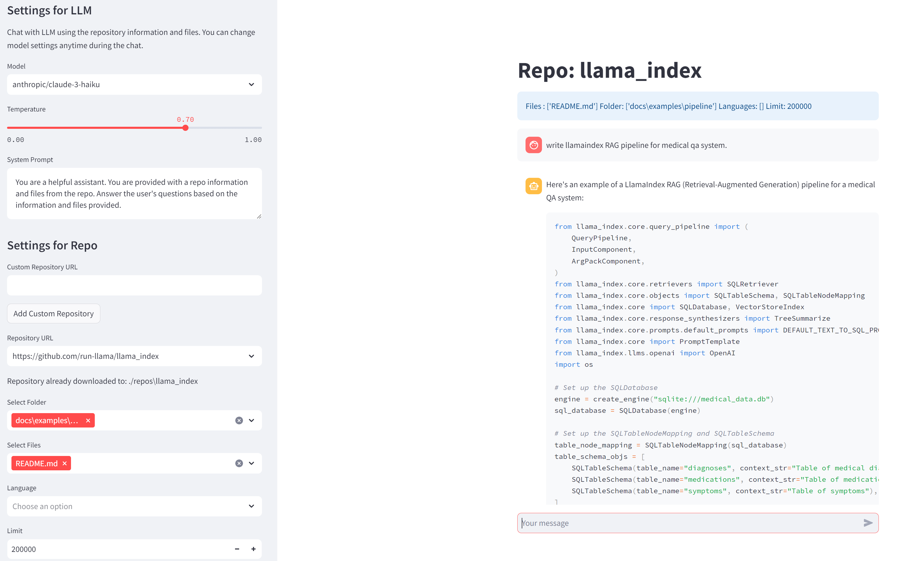
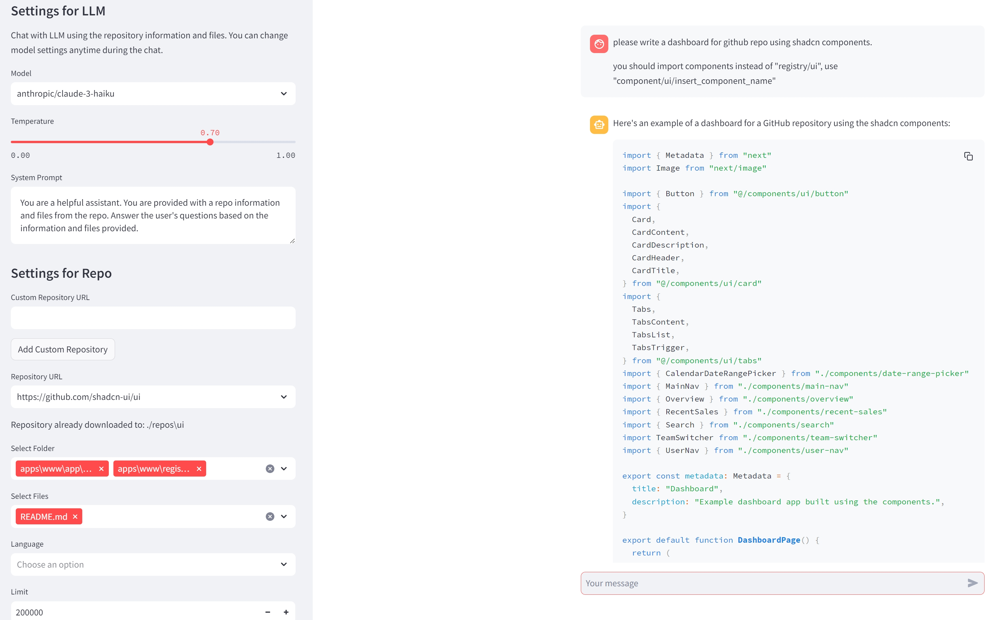
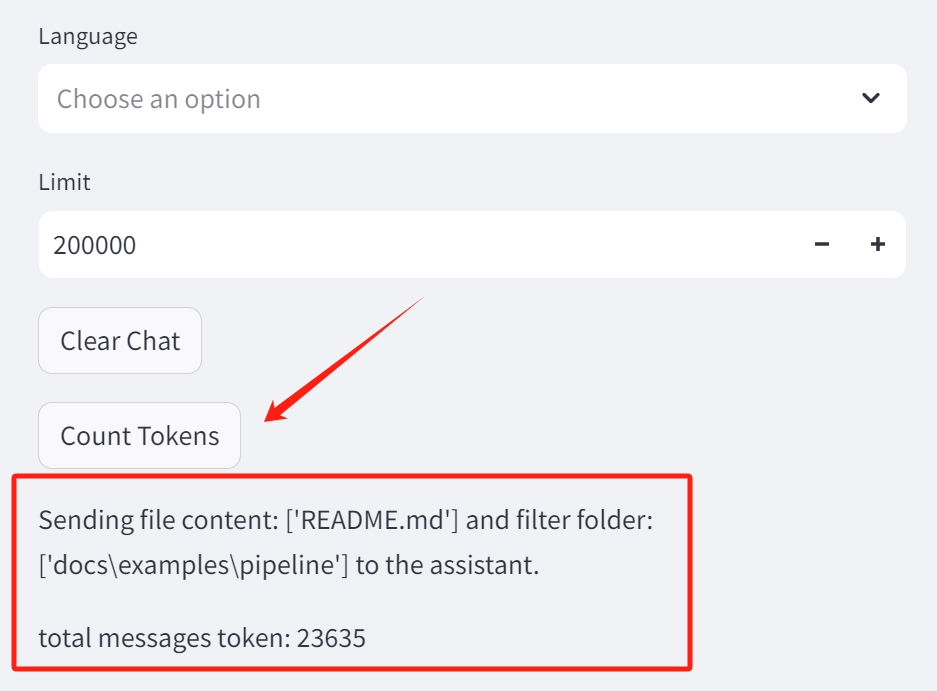

# RepoChat in 200k - No RAG!

⚡Chat with GitHub Repo Using 200k context window of Claude instead of RAG!⚡




## Why RepoChat - No RAG?

Take the advantage of Claude 200k! Put all examples and codes to the contexts!

**We need copilot rather than agent sometimes!**

### 1. Not just Chat, But Write Codes with the Lastest Documents

Have troubles memorizing all the apis in llama-index or langchain? 

No worries, just include the components examples and the documents from the repo and let Claude Opus - the strongest model and long context window of 200k to write your agent for you!

### 2. No copy paste, Just Select



Download/Clone your Repo from Github then just select the files you'd like, I got you covered on constructing the prompt.

### 3. No RAG, You decide

I've seen many Chat with Repo projects, they all have the painpoints:

`Which files do this query need?`

They use **embedding search** in Code database but most of the time I already knew what documents I'm refering... So make your own choices each time when you are coding.

- Coding Frontend? Just select components and examples.

- Coding Agents? Just select Jupyter Notebook of langgraph.

- Coding RAG? Just select Jupyter Notebook of llamaindex.




### 4. More Use Cases!

#### Use llamaindex doc

select llamaindex example of pipeline to write RAG graph.



#### Use Shadcn doc to write frontend

select examples and components definition.




## Suggestions!

1. You can use Haiku for most of the case.
2. Change models based on tasks.
3. Change files based on tasks.
4. Clone Repos You like! 
5. Usually I will include README of repo to help Claude Understand better
6. USE `COUNT TOKENS` on the sidebar to see how many tokens you will send!!!



## Features

1. **Repository Download**: Users can provide a GitHub repository URL, and the application will automatically download and analyze the repository.
2. **File and Folder Selection**: Users can select specific files or folders from the repository to include in the LLM's input.
3. **Language Filtering**: Users can filter the files by programming language to focus the LLM's understanding on specific parts of the codebase.
4. **Token Limit**: Users can set a token limit to control the amount of information sent to the LLM, which can be useful for performance or cost considerations.
5. **Chat Interface**: Users can interact with the LLM through a chat-style interface, allowing them to ask questions or request code generation based on the repository contents.
6. **Streaming Output**: The LLM's responses are displayed in a streaming fashion, providing a more engaging and real-time user experience.

Currently I only supported Openrouter. Planing to add more and refactor someday.

## Get Started

1. **Environment Settings**: Run `pip install -r requirements.txt` to set up environment.

2. **Create a .env file**: Create a `.env` file in the root directory of the project and add your OpenAI API key:
```bash
OPENROUTER_API_KEY=your_openai_api_key_here
```
3. **Run the application**: Run the `app.py` script using Streamlit:
```bash
streamlit run app.py
```
4. **Use the application**: Follow the instructions in the application to download a GitHub repository, select files and folders, and chat with the LLM.

## Configuration

The application's behavior can be customized through the following configuration options:

- **Model**: The specific LLM model to use (e.g., "anthropic/claude-3-haiku", "anthropic/claude-3-opus").
- **Temperature**: The temperature parameter that controls the "creativity" of the LLM's responses.
- **System Prompt**: The initial prompt given to the LLM to set the desired behavior.

These settings can be adjusted in the sidebar of the Streamlit application.

## Contributing

If you'd like to contribute to the RepoChat-200k project, please feel free to submit issues or pull requests on the [GitHub repository](https://github.com/jw782cn/RepoChat-200k).

## License

This project is licensed under the [MIT License](LICENSE).